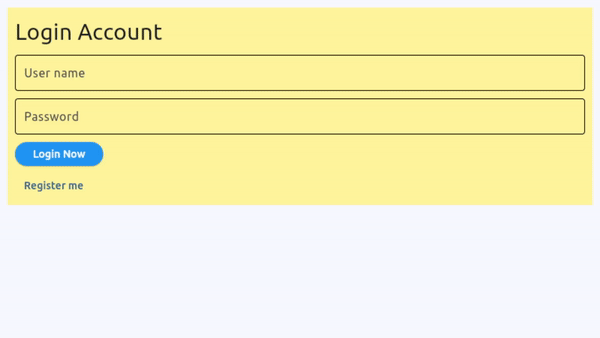

# A flet-login-system Flet app

An example of a minimal Flet app.

Based on [Flet Tutorial - Create Login Logout System](https://www.youtube.com/watch?v=AFxipONjGDQ****)

## Demo



## Run it
To run the app:

```
cd [app_directory]
flet run
```